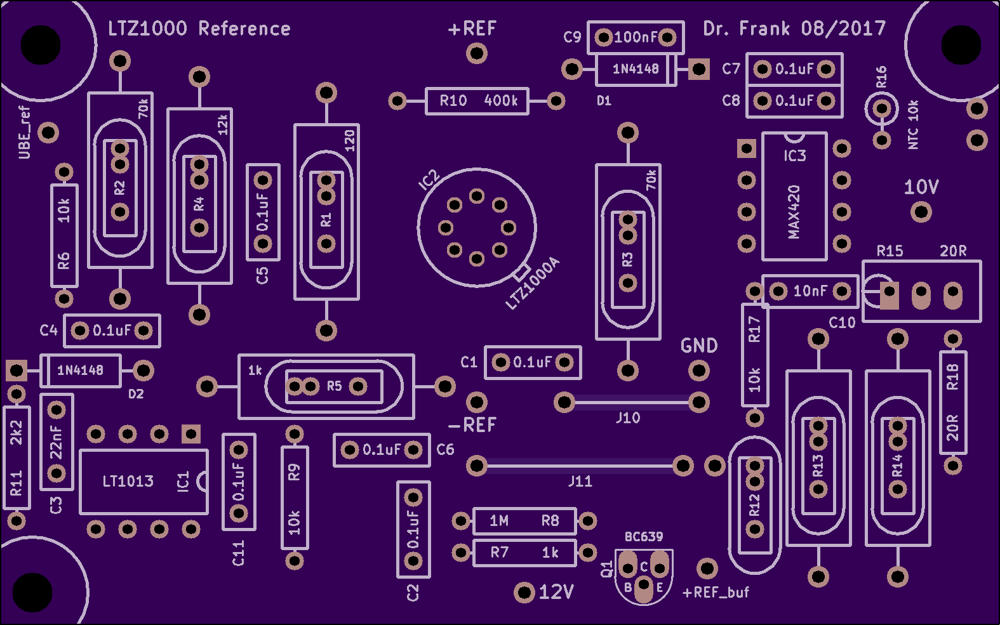
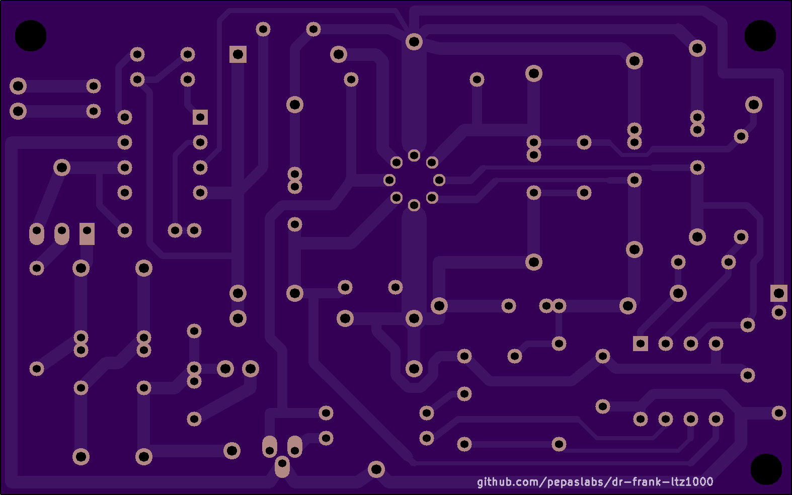

# dr-frank-ltz1000

This is Dr. Frank's LTZ1000-based 10V reference design.

You can order a copy of this board from OSHPark here: [link](https://oshpark.com/shared_projects/gl2aXmlh)

Alternatively, you can use the gerber files to have the board made somewhere else: [gerbers.zip](kicad/releases/v1/gerbers.zip)

Dr. Frank's discussion of his design: [link](http://www.eevblog.com/forum/metrology/mx-reference/msg1297126/#msg1297126).

Dr. Frank's schematic: [jpg](media/LTZ_schematics.jpg)

My recreation of the schematic in kicad: [pdf](kicad/releases/v1/drfrank-ltz1000.pdf)

Dr. Frank's board layout: [jpg](media/LTZ_board.jpg)

I recreated his board layout by importing the jpg of his board design into kicad and matching the layout: [png](media/Screen%20Shot%202017-12-16%20at%202.52.52%20AM)

My post to the EEVBlog forum about this recreation: [link](http://www.eevblog.com/forum/metrology/ultra-precision-reference-ltz1000/msg1376260/#msg1376260)

See also: https://github.com/pepaslabs/px-ref 
